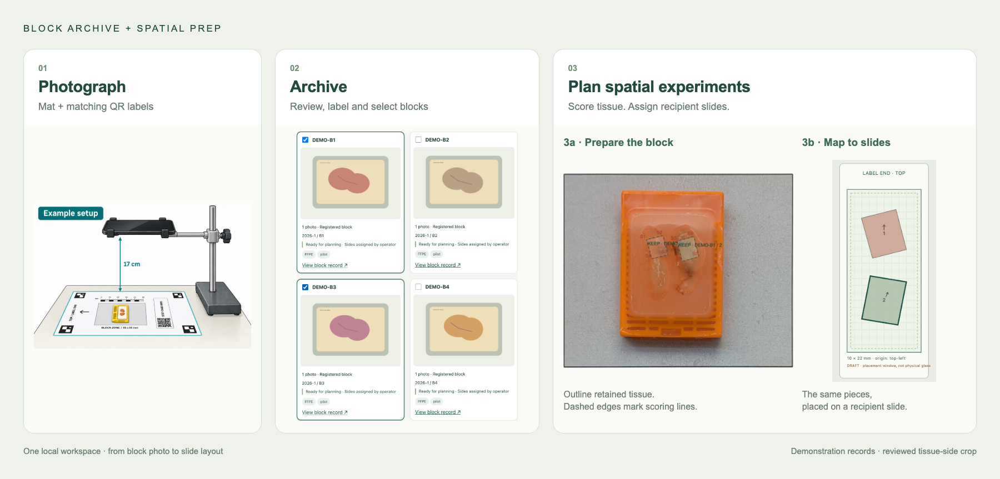

# Block Archive + Spatial Prep

**Photograph blocks. Build an inventory. Plan spatial experiments.**

One local app connects a searchable block-photo archive to tissue scoring, recipient-slide layouts and technician handoff.



*Illustrative photo setup and actual app views. The scoring example uses a real tissue-side crop with no visible identifiers; records and layouts are for demonstration.*

## Quick setup

1. **Get the app:** [download ZIP](https://github.com/noordenbos/block-archive/archive/refs/heads/main.zip) and extract it, or clone this repository. Private-repository access requires an invitation.
2. **Install [uv](https://docs.astral.sh/uv/getting-started/installation/)** once. Open Terminal or PowerShell in the extracted app folder.
3. **Start:**

   ```sh
   uv run --python 3.12 --no-project --with-requirements requirements.txt python server.py
   ```

4. Open **[http://127.0.0.1:8780](http://127.0.0.1:8780)** on that computer. Keep the terminal open while using the app.

The first start downloads Python and dependencies. A new installation starts empty. [Detailed setup and troubleshooting →](docs/wiki/Installation.md)

## Your first experiment

**Photograph → Import & QC → Inventory & plan → Prepare spatial experiment**

Print the mat and matching QR labels, photograph both sides, and import the folder. Review flagged groups, select blocks by ID, labels or metadata, then score retained tissue and assign it to named slides. To resume a plan, use **Prepare spatial experiment → Open experiment**.

**Save project** keeps the whole archive and its experiments; **Save experiment** keeps one plan. Both save directly to a local folder. Use **Save location** to choose it, or keep the default inside `.localdata` in the installation. Git shares the software, not your records or photos.

## Documentation

**[Open the wiki →](docs/wiki/Home.md)**

[Photo inventory & QC](docs/wiki/Photo-inventory.md) · [Spatial experiments](docs/wiki/Spatial-experiments.md) · [Storage & backups](docs/wiki/Storage-and-backups.md) · [Block checkout & return](docs/wiki/Block-checkout.md) · [API & development](docs/wiki/API-and-development.md)

Local research software; see [data handling and deployment scope](SECURITY.md). [PolyForm Noncommercial license](LICENSE) · [Commercial licensing](COMMERCIAL_LICENSE.md). Built from [Spatial Prep](https://github.com/noordenbos/spatial-prep).
